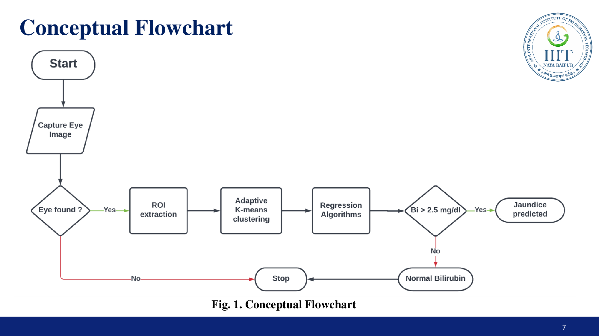
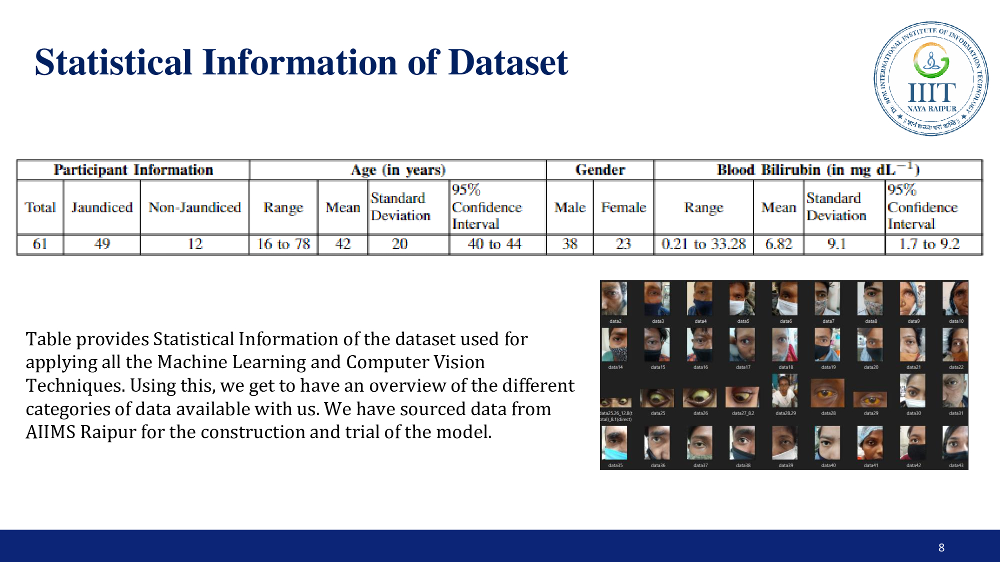
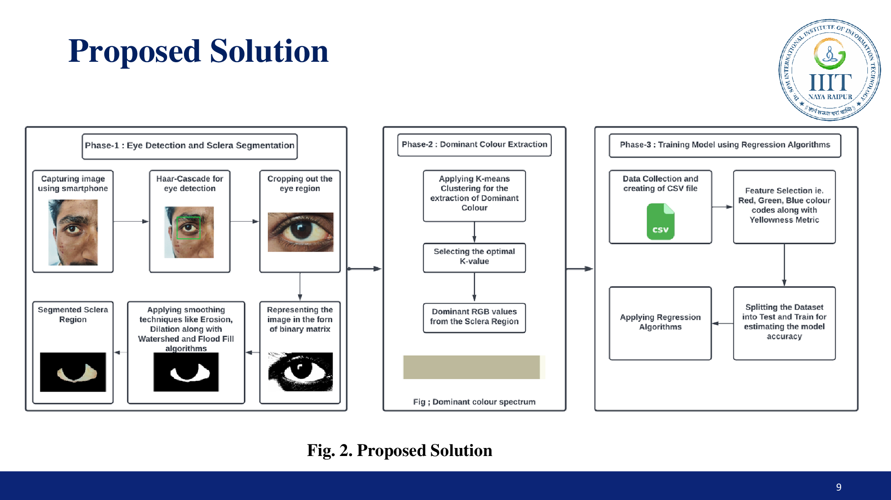
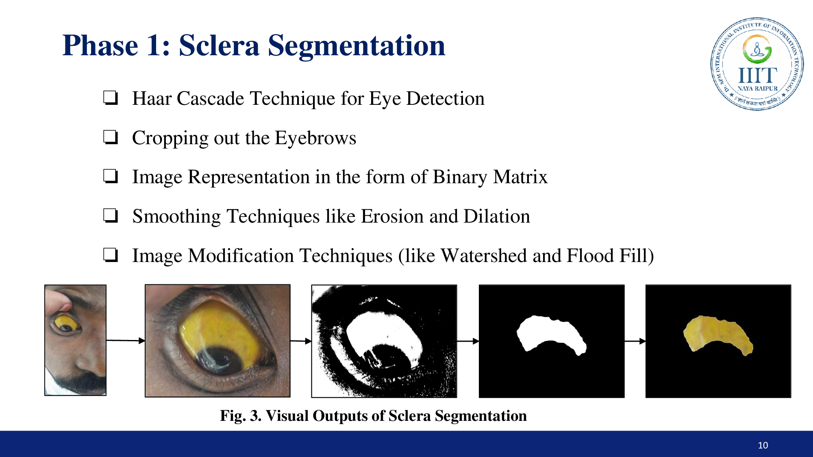
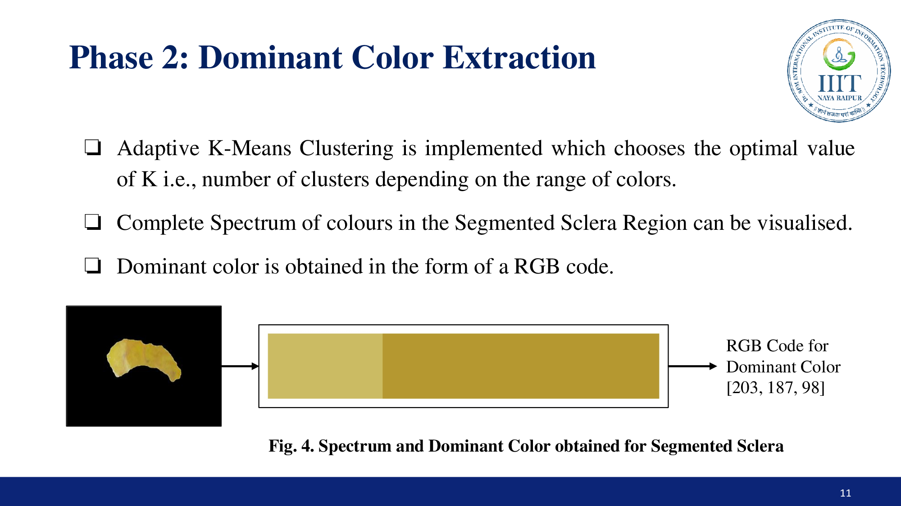
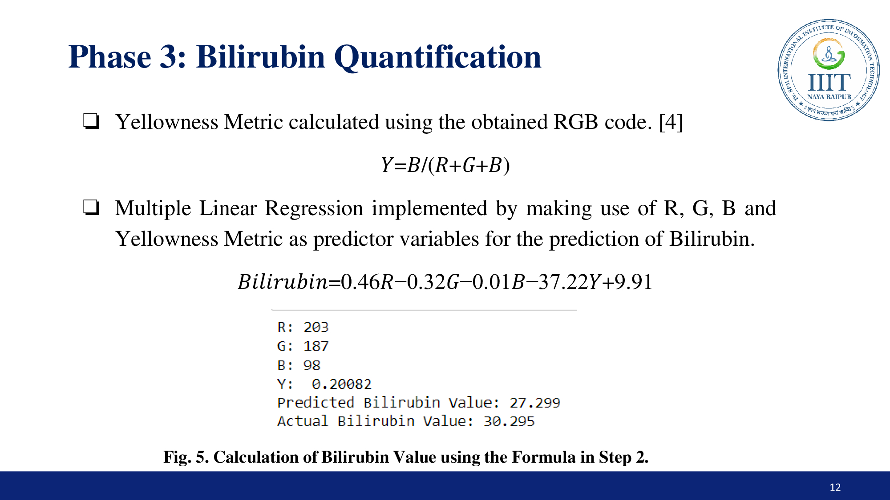
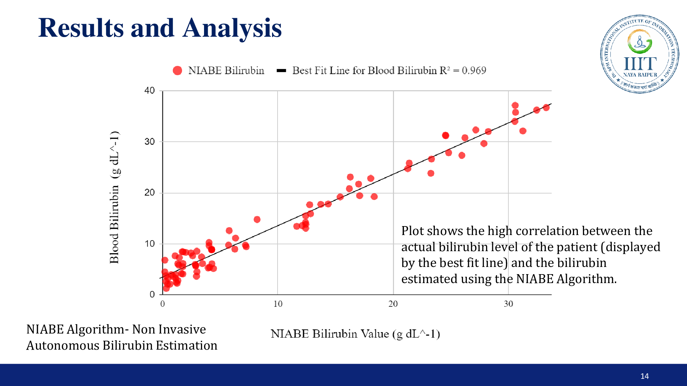
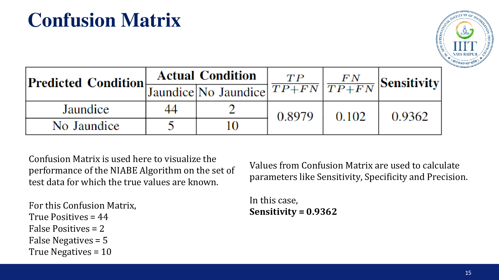

# jScan
## Non-Invasive Technique for Bilirubin Quantification and Jaundice Prediction

## Conceptual Flowchart

 

## Statistical Information of Dataset

 

## Proposed Solution

 

## Phases of Implementation

### Phase 1: Sclera Segmentation

 

### Phase 2: Dominant Color Extraction

 

### Phase 3: Bilirubin Quanitification

 

## Results and Analysis

 

## Confusion Matrix

 
